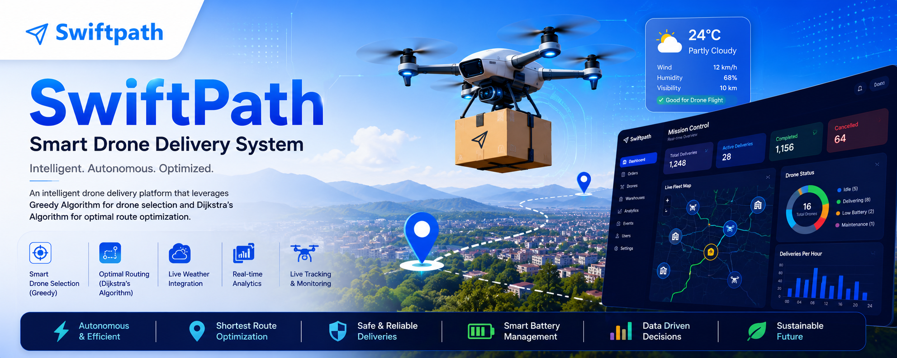

<p align="center">
  
</p>

<h1 align="center">🚁 SwiftPath - Smart Drone Delivery System</h1>

<p align="center">
An intelligent drone delivery platform using <b>Greedy Algorithm</b> for Battery-Aware Drone Selection and <b>Dijkstra's Algorithm</b> for Route Optimization.
</p>

<p align="center">


</p>

---

# 📌 Overview

SwiftPath is a **full-stack intelligent drone delivery management platform** designed to simulate modern logistics operations.

The system allows customers to place delivery orders, automatically assigns the most suitable drone using a **Greedy Battery-Aware Selection Algorithm**, computes the optimal warehouse-to-destination route using **Dijkstra's Shortest Path Algorithm**, and provides real-time delivery tracking through an interactive mission control dashboard.

The application also includes an enterprise-style **Admin Mission Control Dashboard**, live fleet monitoring, analytics, warehouse management, and complete system architecture documentation.

---

# ✨ Key Features

## 👤 Customer Module

- User Registration & Login
- Secure Authentication
- Place Delivery Orders
- Interactive Warehouse Selection
- Live Order Tracking
- Real-Time Drone Status
- Delivery History
- Responsive Dashboard

---

## 🚁 Intelligent Drone Allocation

SwiftPath automatically selects the most appropriate drone using a **Greedy Battery-Aware Selection Algorithm**.

The algorithm considers:

- Battery Level
- Drone Availability
- Distance from Warehouse
- Operational Status

The drone requiring the least travel while maintaining sufficient battery is automatically assigned.

---

## 🗺 Route Optimization

After drone selection, the delivery route is optimized using the **Dijkstra Shortest Path Algorithm**.

The routing engine:

- Computes shortest warehouse path
- Calculates cumulative edge weights
- Minimizes delivery distance
- Reduces estimated delivery time
- Supports multiple connected warehouse hubs

---

## 📍 Live Tracking

The tracking system provides:

- Live drone position
- Active route visualization
- Warehouse markers
- Destination marker
- Route Optimization Panel
- Interactive Dijkstra Graph
- Weather Alert Panel
- Delivery Timeline
- ETA updates

---

## 🎯 Interactive Dijkstra Visualization

Unlike a static diagram, SwiftPath includes an interactive graph demonstrating the routing algorithm.

Features include:

- Start Node
- Destination Node
- Warehouse Nodes
- Shortest Path Highlight
- Edge Weights
- Zoom & Pan
- Fullscreen Mode
- Route Optimization Details

The visualization acts purely as a frontend representation while all routing calculations remain on the backend.

---

## 🛰 Admin Mission Control Dashboard

The Admin Dashboard provides an enterprise-grade logistics control center.

### KPI Dashboard

- Total Deliveries
- Active Deliveries
- Completed Deliveries
- Cancelled Deliveries
- Fleet Utilization
- Available Drones
- Average Delivery Time
- Average Battery Level

---

### Fleet Management

- Live Drone Status
- Warehouse Assignment
- Delivery Destination
- Docked Drones
- Active Deliveries
- Battery Monitoring

---

### Analytics

Interactive Chart.js visualizations include:

- Deliveries per Hour
- Drone Status Distribution
- Warehouse Workload
- Battery Distribution
- Delivery Success Rate

---

### Live Operations Map

The Mission Control map displays:

- Standardized Warehouse Network
- Active Delivery Routes
- Drone Positions
- Customer Destinations

---

# 🧠 Algorithms Used

## Greedy Battery-Aware Drone Selection

The system evaluates all available drones and selects the optimal candidate based on:

- Minimum distance
- Highest battery
- Availability
- Operational readiness

This minimizes dispatch time while maintaining delivery efficiency.

---

## Dijkstra Shortest Path Algorithm

The routing engine models the warehouse network as a weighted graph.

Each warehouse represents a node while road distances represent weighted edges.

The algorithm computes:

- Shortest Path
- Minimum Cumulative Edge Weight
- Optimal Warehouse Sequence

Time Complexity:

```
O((V + E) log V)
```

---

# 🏗 System Architecture

```
Customer
    │
    ▼
Authentication
    │
    ▼
Order Placement
    │
    ▼
Greedy Drone Selection
    │
    ▼
Dijkstra Route Optimization
    │
    ▼
Warehouse Network
    │
    ▼
Drone Dispatch
    │
    ▼
Live Tracking
    │
    ▼
Mission Control Dashboard
```

A dedicated **System Architecture** page is included inside the application for detailed visualization.

---

# 🗄 Database

SwiftPath supports two databases.

### Development

- SQLite

### Production

- PostgreSQL

The application automatically switches databases using the `DATABASE_URL` environment variable.

Safe database seeding prevents accidental deletion of production data.

---

# 🛠 Technology Stack

## Backend

- Python
- Flask
- SQLAlchemy
- Flask-Login
- Flask-WTF
- Flask-Bcrypt

## Database

- PostgreSQL
- SQLite

## Frontend

- HTML5
- CSS3
- Bootstrap 5
- JavaScript

## Visualization

- Leaflet.js
- Chart.js
- SVG

## Deployment

- Render
- Gunicorn

---

# 📂 Project Structure

```
SwiftPath
│
├── static/
│   ├── css/
│   ├── js/
│   └── images/
│
├── templates/
│   ├── admin_dashboard.html
│   ├── customer_dashboard.html
│   ├── track_order.html
│   ├── place_order.html
│   └── system_architecture.html
│
├── app.py
├── routes.py
├── models.py
├── requirements.txt
└── README.md
```

---

# 📸 Screenshots

## Customer Dashboard

> Add screenshot here

---

## Place Order

> Add screenshot here

---

## Live Tracking

> Add screenshot here

---

## Dijkstra Visualization

> Add screenshot here

---

## Admin Mission Control

> Add screenshot here

---

## System Architecture

> Add screenshot here

---

# ⚙ Installation

## Clone Repository

```bash
git clone https://github.com/yourusername/SwiftPath.git

cd SwiftPath
```

---

## Create Virtual Environment

```bash
python -m venv venv
```

Activate

Windows

```bash
venv\Scripts\activate
```

Linux

```bash
source venv/bin/activate
```

---

## Install Dependencies

```bash
pip install -r requirements.txt
```

---

## Run Application

```bash
python app.py
```

Open

```
http://127.0.0.1:5000
```

---

# 🚀 Deployment

SwiftPath is production-ready and supports deployment on:

- Render
- Railway
- Replit
- Docker
- Any WSGI-compatible cloud platform

Production uses PostgreSQL while local development uses SQLite.

---

# 🔒 Design Principles

- Separation of Concerns
- Backend as Single Source of Truth
- Responsive UI
- Safe Database Initialization
- Production-Ready Architecture
- Clean API Design
- Interactive Algorithm Visualization

---

# 📈 Future Enhancements

- Real Drone GPS Integration
- AI-Based Route Prediction
- Weather API Integration
- Multi-City Warehouse Networks
- Battery Consumption Prediction
- Live Traffic Optimization
- Multi-Drone Coordination
- Delivery Notifications
- Mobile Application
- Kubernetes Deployment

---

# 👨‍💻 Developed By

| Name | Role |
|------|------|
| **Hitesh Kumar** | Backend Development, Algorithms, Database Design, System Integration |
| **Anjali Sinha** | Frontend Development, UI/UX Design |
| **Vasu Singh** | Frontend Development, Testing & Documentation |
| **Rahul Raj** | Backend Support, Testing & Deployment |

---

# 📄 License

This project is licensed under the **MIT License**.
